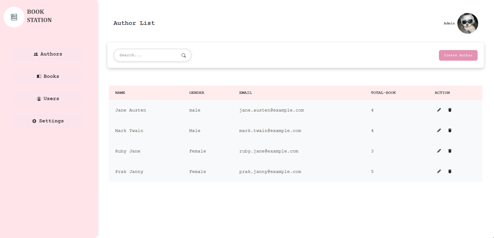
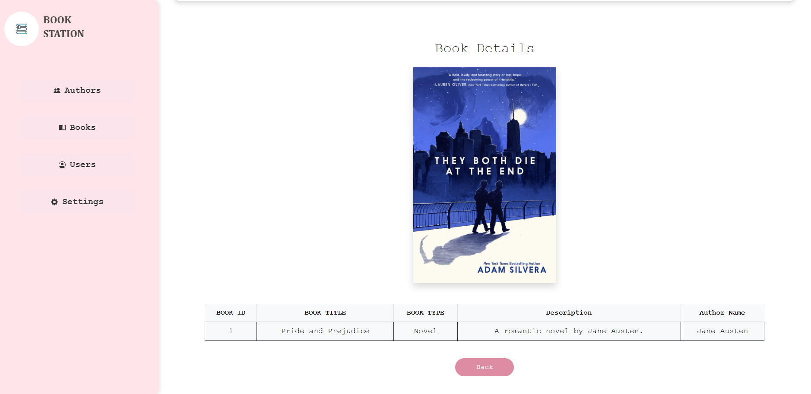

# 📚 Laravel Book & Author Management System

A simple Laravel web application to manage books and their authors. Features include book CRUD, author management, image uploads, soft deletes, and responsive UI using Blade and Bootstrap.

## 🚀 Features

- Manage **Books** with:
  - Title, Type, Description, Cover Image, Author
  - Soft delete functionality
  - Cover image upload
- Manage **Authors** with:
  - Name, Gender, Email
- Relational database using **Eloquent ORM**
- Responsive UI using **Blade templates** and **Bootstrap**
- Laravel routing, validation, seeding, and migrations

---

## 🧱 Tech Stack

- **Laravel 10+**
- **MySQL** / **MariaDB**
- **Bootstrap 5**
- **PHP 8+**
- **Blade Templating**
- **Laravel Storage (public disk)**

---

## 📂 Folder Structure

```bash
├── app/
│   └── Models/               # Book.php, Author.php
├── database/
│   ├── migrations/           # Table creation
│   ├── seeders/              # Sample data
├── public/
│   └── storage/book/         # Uploaded cover images
├── resources/
│   └── views/                # Blade templates
├── routes/
│   └── web.php               # Route definitions
```
## ⚙️ Setup Instructions

1.Clone the repo
 - git clone https://github.com/navyhorng/Laravel_BookAuthor.git
- cd Laravel_BookAuthor
    
2. Install dependencies
    - composer install
    - npm install && npm run dev
      
3. Configure environment
    - cp .env.example .env
    - Update .env with your database settings
      
4. Run migrations and seeders
    - php artisan migrate --seed

5. Serve the application
    - php artisan serve

## 📸 Screenshots





## 🧑‍💻 Author

** Horng Navy **
 [GitHub Profile]([https://github.com/horngnavy](https://github.com/navyhorng))
